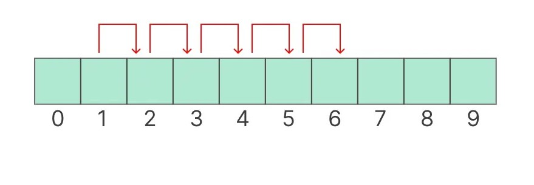

# Implementation av hashtabell

Det här impleterar en hashtabell som skapar en lista som innehåller nycklar, där varje nyckel har ett motsvarande värde

Den är byggd med linjär probing vi kollision, så om två nycklar har samma hash index kommer den nya nyckeln att ta nästa lediga plats istället. 

Nycklarna får endast var stränger men value kan ha vilket värde som helst förutom None.

## Metoder
- insert(key, value): Sätter in en nyckel och motsvarande värde i vår hashtabell.
- find(key): Tar fram det motsvarande värdet till nyckel.
- remove(key): Raderar nyckeln från hashtabellen.

## Exempel på användning

### Skapa en ny hashtabell
hash_table = HashTable()

### Lägg till nycklar och värden
hash_table.insert('Bob', 15)

hash_table.insert('Alice', 30)

### Hämta värden
print(hash_table.find('Bob'))  # Output: 15

### Ta bort nyckel
hash_table.remove('Alice')

print(hash_table.find('Alice'))  # Output: None

## Roadmap

* The API of this library is frozen.
* Version numbers adhere to semantic versioning.

The only accepted reason to modify the API of this package is to handle issues that can't be resolved in any other reasonable way.

Version 1.0.0